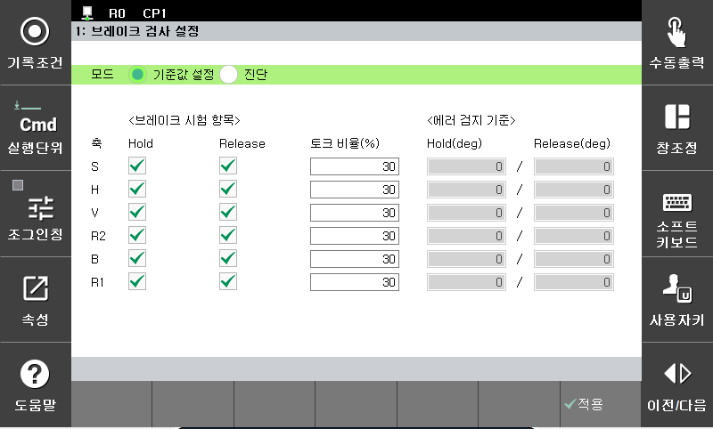

# 2.1 브레이크 검사 설정
1. 작업 프로그램에 brake_check 명령어를 삽입합니다.

    

2. brake_check 명령어에서 속성 버튼을 클릭하여 설정 메뉴로 진입합니다.

- 모드
    - 기준값 설정  
    에러 감지 기준을 실제 시스템에 맞도록 변경하고자 하는경우 사용하는 기능입니다. 기준값 설정 모드를 선택하면 ‘브레이크 시험 항목’ 및 ‘에러 감지 기준’이 비활성화 되어 기준값 설정 모드가 됩니다.

        

    - 진단  
    각 축별로 시험 항목과 에러 검지 기준을 설정할 수 있는 기능입니다.

        
  

- 브레이크 시험 항목  
각 축별로 Hold, Release 시험 여부를 선택합니다. 일반적인 경우 Hold, Release 모두 수행하도록 선택합니다. 시험 항목은 진단모드일 경우에만 설정 가능합니다.
    - Hold 테스트  
    브레이크가 작동하는 상태로 3초간 토크를 적용하며, 3초 이내에 모터 각도의 움직임이 기준치를 초과하는지 검사합니다.
    기준치를 초과하는 경우 아래 경고를 출력한 후 다음 축으로 테스트를 계속 진행합니다. 
    ‘W0162 Brake hold 테스트 중 이상이 검출되었습니다.’

    - Release 테스트  
    브레이크가 열린 상태로 3초간 토크를 적용하며, 3초 이내에 모터 각도의 움직임이 기준치에 도달하는지 검사합니다.
    기준치에 도달하지 못하는 경우 아래 경고를 출력한 후 다음 축으로 테스트를 계속 진행합니다. 
    ‘W0163 Brake release 테스트 중 이상이 검출되었습니다.’
  

- 토크 적용 비율  
각 축별로 테스트 시 모터에 적용할 토크의 비율을 설정합니다. 토크의 크기는 모터의 정격 마찰토크(모터 브레이크의 최대 토크)에 대한 비율 값입니다. 대부분의 경우 초기에 설정된 비율을 그대로 사용하는 것을 권장합니다. 
단, 기준값 설정 시 다음과 같은 경우가 발생하는 경우 이 값을 조절하십시오.
    -	Hold test 시 변화가 너무 커서 경고가 발생하는 경우  
        → 토크 적용 비율을 낮추십시오.
    -	Release test 시 각도 변화가 너무 작아 경고가 발생하는 경우  
        → 토크 적용 비율을 높이십시오.
  

- 에러 감지 기준
각 축별로 Hold, Release 시험 시 사용할 에러 기준값을 설정합니다. 이 값은 ‘기준 설정 모드’에서 브레이크 검사 명령어를 실행하면 자동으로 설정할 수 있습니다.

    - Hold  
    Hold 테스트 시 사용할 기준값(deg)입니다. 브레이크 Hold 검사를 좀 더 정밀하게 수행하려면 이 값을 낮게 설정하십시오.

    - Release  
    Release 테스트 시 사용할 기준값(deg)입니다. 브레이크 Release 검사를 좀 더 정밀하게 수행하려면 이 값을 높게 설정하십시오.