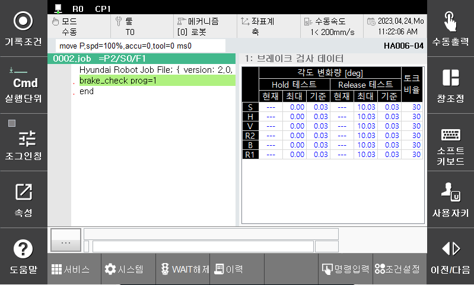

# 2.2 브레이크 검사 데이터 모니터링
브레이크 검사 실행 상태와 각 축별 각도 변화량의 최대값을 확인할 수 있는 모니터링 기능입니다.

1. panel 선택 창에서 '시스템 진단' 메뉴를 선택합니다.

2. 브레이크 모니터링의 정보는 다음과 같습니다.

-	현재: 테스트를 실행하는 축의 축각도 변화량
-	최대: 테스트 중 축각도 변화량의 최대값
-	기준: Hold/Release 테스트 후 이상 여부를 판단하는 기준값
-	토크적용 비율: 시험에 사용한 토크의 정격 마찰토크 대비 비율

3. 기준값 설정 모드인 경우 축 이름이 황색으로 표시됩니다.

