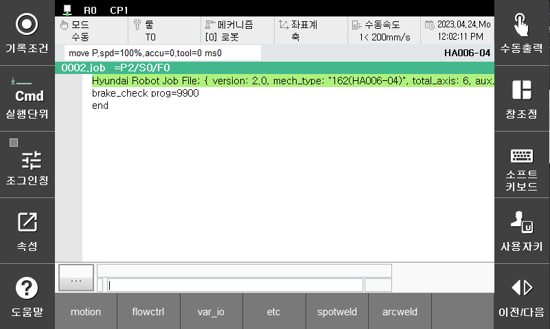
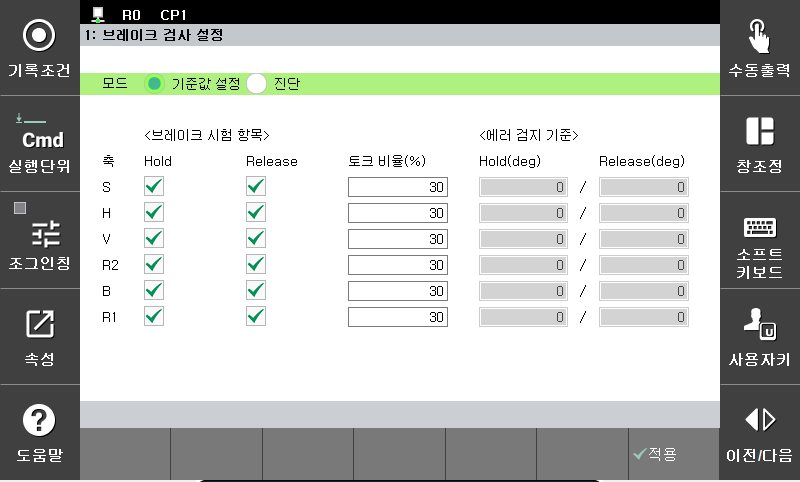
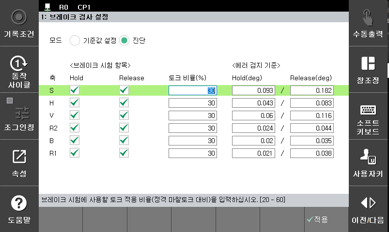

# 3.2 브레이크 검사 예시
1. 작업 프로그램에 brake_check 명령어를 삽입 후 퇴피 프로그램 번호를 입력합니다.

    

2. brake_check 명령어에서 속성 버튼을 클릭하여 설정 메뉴로 진입합니다.

3. '기준값 설정' 모드를 선택합니다.

    

    
4. '확인' 버튼을 클릭 후 brake_check 명령어를 실행합니다. 명령어 실행 중에는 모니터링 기능을 통해서 검사 결과를 확인할 수 있습니다.

5. 다시 브레이크 검사 설정 대화상자로 진입합니다. 에러 감지 기준이 정상적인 값으로 입력되었는지 확인합니다.

    

6. 각 축별로 테스트 할 항목을 선택 후 저장합니다.

7. brake_check 명령어를 수행합니다.
    - 만약 브레이크 Hold 검사 중 에러가 검출된 경우 퇴피 위치 이동을 위한 퇴피용 작업 프로그램 9900번 작업 프로그램을 자동으로 CALL 합니다. 브레이크 이상 검지용 출력신호를 내보내면서 브레이크가 풀려도 안전한 위치로 이동 후 모터 온 상태를 유지하면서 정지합니다.